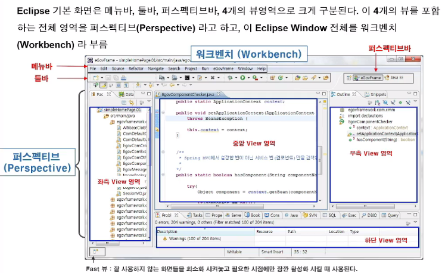
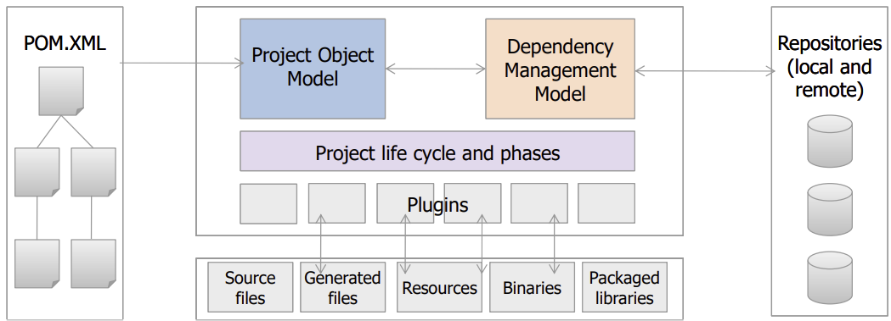
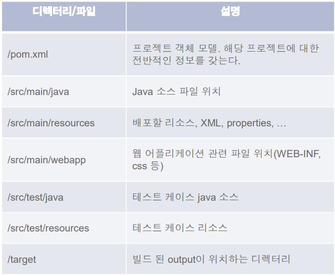
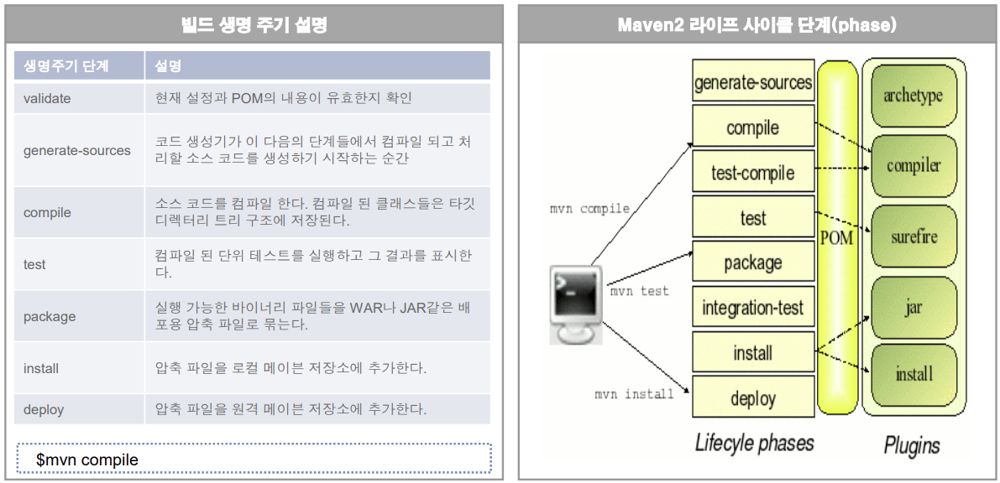
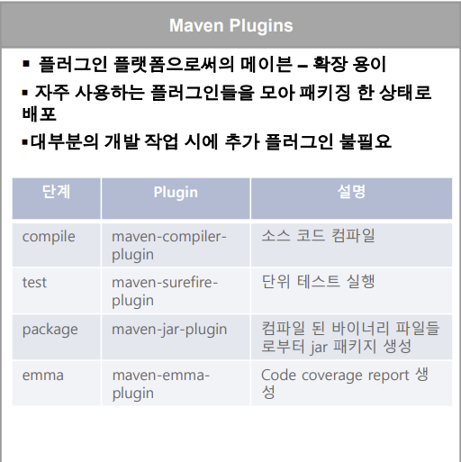
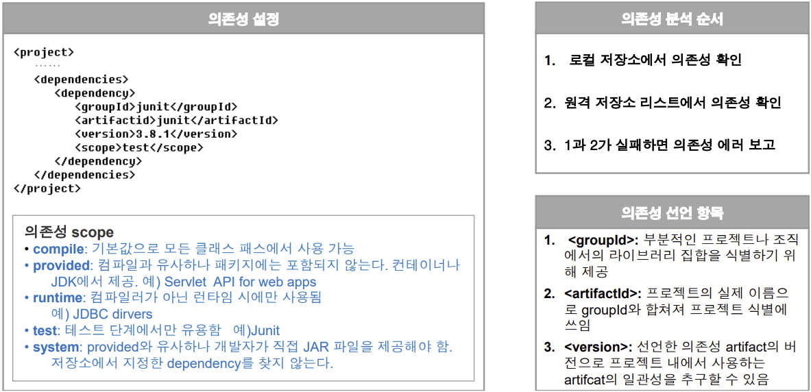
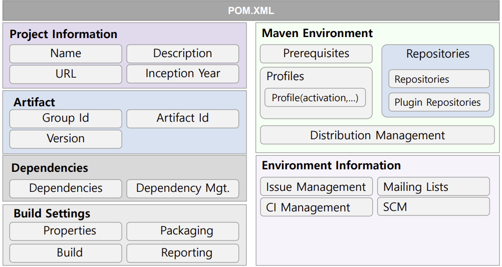

### 개발환경
개발 환경은 응용 s/w 개발자를 위한 환경

#### 1. Package 구성
구현도구는 Eclipse Java EE를 기반으로 Package와 UML, ERD, DBIO Editor와 Template Project, Common Component, Customize Development Tool, 배치 Template 및 Job 생성 플러그인으로 구성

#### 2. 개인빌드
1. Maven
    
    '불필요한 설정을 최소화'한다는 개념 아래 Ant와 같은 빌드 기능을 제공할 뿐 아니라 구조화 된 빌드 기능을 통해 learnign curve 및 재사용성을 향상시킴
    |장점|단점|
    |---|---|
    |뛰어난 의존성 관리 의존성 자동 업데이트|repository관리의 불편함|
    |모든 프로젝트에 걸쳐 쉽게 적용 가능한 일관적인 사용법|pom.xml 파일 관리 메이븐 프로젝트 관리에 대한 모든 내용이 pom.xml 파일에 담기게 되므로 길고 장황하게 될 수 있음|
    |쉽게 작성 가능한 플러그인을 통한 확장성|프로젝트에 특화된 복잡한 빌드 기능 제약|
    |-동시에 다수의 프로젝트 핸들링 할 수 있는 쉬운 설정 기반의 메커니즘 -간단한 설정을 통한 배포 관리 -다수의 프로그래밍 언어 지원||
    ** 의존성 자동 업데이트 : A를 올렸을 때 A가 필요로 하는 B도 알아서 올려줌

2. Maven 아키텍쳐

    - 프로젝트 객체 모델(POM) : 메이븐 엔진 내장 + POM.XML 파일에서 선언적으로 제공
    - 의존성 관리 모델 : 로컬 및 리모트 저장소를 이용하여 관리
    - 빌드 생명주기와 각 단계 : 잘 정의된 단계들과 빌드 사이클에 따라 플러그인들을 조율

3. Maven 디렉터리 구조
Best practices을 기반으로 정규화된 디렉터리 구조를 제공하고 있으며 모드 소스 파일들은 /src 디렉터리 밑에, 빌드된 output은 /target 디렉터리 밑에 위치함

4. 빌드 Lifecycle
메이븐 빌드는 소프트웨어 프로젝트의 핵심적인 빌드 라이프 사이클 개념을 따르고 있으며 빌드부터 artifact의 배포까지의 라이프 사이클을 정의하고 있음

5. Maven 플러그인
메이븐은 대부분의 빌드 작업 시에 플러그인을 활용하여 메이븐 엔진이 생명주기 단계들과 플러그인을 바인딩 시켜 빌드 작업을 컨트롤 함

6. 의존성 관리 메커니즘
POM에서 선언적인 dependency 설정으로 빌드 및 배포시에 필요한 라이브러리들을 관리하고 로컬 및 원격 저장소에서 선언된 라이브러리들을 다운로드 받아 사용함

7. Maven Repository
artifact들의 저장소로 로컬 및 리모트 repository로 구성되며 프로젝트는 pom.xml에서 선언한 dependency들을 저장소로부터 불러와서 사용함

    - 로컬 repository : artifact들을 로컬 파일 시스템에 cache하는 기능으로 리모트 repository에서 다운로드 받아 artifact들을 저장하고 관리
    - 리모트 repository : 주로 HTTP서버로 3rd 파티에서 제공하는 artifact들을 제외한 거의 모든 artifact들을 제공
    -Nexus : 메이븐 repository 관리툴. 리모트 repository의 단점을 보완하고 메이븐 프로젝트의 사용 편의성을 높이기 위해 사용. 개발자들은 리모트가 아닌 Nexus에서 dependency을 다운받아 사용함으로써 프로젝트의 artifact 버전 등의 일관성을 유지하고 3rd 파티 artifact 등 라이브러리를 효과적으로 공유 가능

8. 프로젝트 객체 모델 (POM)
프로젝트의 구조와 내용을 설명하고 있으며 pom.xml 파일에 프로젝트 관리 및 빌드에 필요한 환경 설정, 의존성 관리 등의 정보들을 기술함

