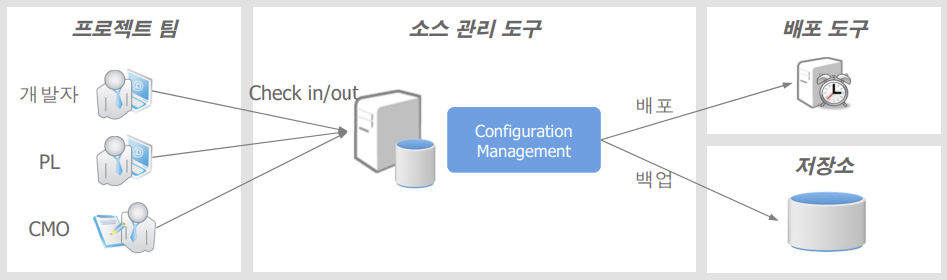

### 개발환경 - 테스트 도구
#### 1. 테스트(Test) : 테스트 대상에 입력값을 넣었을 때 그 결과가 성공 혹은 실패의 결과를 내는 것
||수동 테스트|자동 테스트|
|---|---|---|
|장점|-쉽고 간편 -테스트 불가능한 상황이 별로 없음|-같은 테스트 여러 번 수행 가능 -기존 테스트는 새 테스트 작성의 발판(축적) -빨라서 자주 돌려볼 수 있음 -개발자가 코드 개선 활동을 수행할 때에도 회귀테스트를 자주 할 수 있음|
|단점|-휘발성 -다른 사람에게 내용 설명이 어려움 -재현 어려움|-코드로 작성해야 함 -모듈화가 잘 되어 있어야 함|

#### 2. 테스트 도구
Unit Test, Mock, DB Test Framework을 통해 TestCase 작성을 지원하고, Test Automation, Test Coverage, Test Reporting 등의 기능을 제공

- Unit Test
대상 코드에 대해 테스트하기 위해 개발자가 작성한 코드로 주로 특정 메소드를 실행해서 그 결과가 기대값과 일치하는지 확인하는 형태, Unit Test는 서로 독립적으로 수행되어야 함.

    <효과>
    1) 작성한 코드의 설계 개선 작업 시, 코드 품질에 대한 확신
    2) 코드 수정 시 버그를 쉽게 찾을 수 있음
    3) 자동화된 회귀 테스트를 가능하게 해주는 Source가 됨

- JUnit
    
    자바 프로그래밍 언어를 위한 Unit Test Framework로 Unit Test 코드를 작성하고 자동화된 테스트를 수행할 수 있는 기능을 제공

- Mock

    Mock 객체는 Unit Test의 독립성(isolation)을 높여주기 위해 사용, 테스트를 하기 위해 코드와 관련이 있는 객체(collaborator)를 흉내내어 Unit Test를 수행할 수 있도록 도와주는 객체

- Batch Job Test
배치 테스트 도구를 통해 기 개발된 일괄처리 모듈에 대한 Junit 테스트 파일생성 및 테스트 수행과 함께 기존에 생성한 Junit 테스트 파일을 재실행할 수 있는 기능을 제공

- DB Test
DAO와 DB 모두 통틀어 Persistence layer를 테스트하는 것, 테스트 DB와 테스트 데이터를 준비하여 실제로 DB를 이용한 단위테스트를 수행함

#### 3. 형상관리
소스 버전관리 도구는 시스템 형상 요소(소스 및 데이터)를 문서화하고 변경을 소스 버전관리 절차에 따라 관리하고, 효율적으로 처리하기 위한 통제 환경을 의미

- 형상관리 : 소프트웨어의 변경사항을 체계적으로 추적하고 통제하는 것
    1. 저장소(Repository) : 모든 프로젝트의 프로그램 소스들과 소스에 대한 변경 사항이 저장되고 네트워크를 통해 여러 사람이 접근 가능
    2. Revisions : 소스 파일 등을 수정하여 커밋하게 되면 일정한 규칙에 의해 숫자가 증가. 저장소에 저장된 각각의 파일 버전이라 할 수 있음

#### 4. CI(Continuous Integration) 서버
여러 명으로 구성된 팀이 작업한 것을 자주 통합하는 것을 가리키는 소프트웨어 개발 Practice로, 개발자, 버전 관리 저장소, 통합 빌드 머신 등으로 구성

- 효과
    1. 에러를 초기에 발견할 수 있다.  자주 통합할수록 에러가 발생하는 범위가 좁아 에러를 잡는 것이 수월해진다.
    2. 반복적인 수작업을 줄여준다
    3. 프로젝트 가시성을 좋게 해준다 
 
- Jenkins

    오픈소스 CI 서버로 소스 빌드 스크립트를 사용한 자동 빌드 및 빌드 결과를 개발자에게 피드백하는 매커니즘을 제공함
