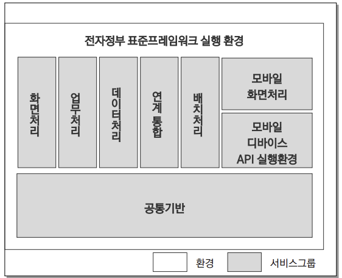

### 실행환경
전자정부 개발프레임워크 환경은 4개로 구성
첫째, 응용sw를 위한 실행환경 
둘째, 응용sw 개발자를 위한 개발환경 
셋째, 응용sw 운영자를 위한 운영환경 
넷째, 개발프레임워크 관리자를 위한 관리환경으로 구성됨

#### 1. 실행환경
- 업무 프로그램의 실행에 필요한 공통 모듈 및 업무 공통 서비스를 제공함
- 응용sw의 구성기반이 되며 응용sw 실행 시 필요한 기본 기능을 제공하는 환경

#### 2. 실행환경 특징
- 8개 서비스 그룹 : 화면처리, 업무처리, 데이터처리, 연계통합, 공통기반, 배치처리, 모바일 화면처리, 모바일 디바이스 API 실행환경
- MVC, **loC 컨테이너, AOP, Data Access**, Integration 등의 핵심 서비스 39개를 제공
- 39개 서비스 별 최적의 오픈 소스 소프트웨어 선정
- 경량화된 개발프레임워크로서 사실상 업계 표준에 가까운 Spring 프레임워크를 적용
- DI(Dependency Injection) 방식의 의존 관계 처리 : 개체나 컴포넌트 간의 의존성을 정의함으로써 변경용이성과 재사용성을 향상
- AOP(Aspect Oriented Programming) 지원 : 트랜잭션, 예외처리와 같은 공통 관심 대상을 분리하여 정의함
- MVC Model2 아키텍처 구조 제공 및 다양한 UI 클라이언트 연계 지원

    
#### 3. 실행환경 
    1) 화면처리 레이어
        - MVC : MVC 디자인 패턴을 적용하여 사용자 화면을 개발할 수 있도록 MVC 기반 구조를 제공
        - Internationalization : 다양한 지역과 언어 환경을 지원할 수 있는 서비스. 다국어 기능을 제공
        - Ajax Support : Ajax는 대화식 웹 애플리케이션의 제작을 위해 HTML과 DOM, 자바스크립트, XML, JSON과 같은 조합을 이용하는 웹 개발 기법. Ajax 기능 지원을 위한 JQuery를 제공
        - Validation : 사용자의 입력값 유효성을 검증할 수 있는 기능을 제공
        - UI Adaptor : 업무처리 레이어에서 사용할 데이터 타입을 정의하고, in/out parameter를 해당 구현 방식에 맞게 변환해주는 기능을 제공

    2) 업무처리 레이어
        - Process Control : 비즈니스 로직과 업무 흐름의 분리를 지원
        - Exception Handling : 예외사항을 처리하기 위해 표준화된 방법을 제공
    
    3) 연계 통합 레이어
        - Naming Service : 원격에 있는 모듈 및 자원 등을 찾아주는 기능을 제공
        - Web Service : 웹 서비스의 형태로 어플리케이션 외부에 노출시켜 타 시스템이나 어플리케이션에서 서비스를 이용할 수 있도록 하는 기능을 제공
        - Integration Service : 전자정부 시스템과의 연계를 위한 공통 인터페이스를 제공하여, 다양한 솔류션 연계 방식에 대한 표준화된 처리 방식을 제공
    
    4) 데이터 처리 레이어
        - Data Access : 다양한 데이터베이스 솔루션 및 데이터베이스 접근 기술에 대한 추상화된 접근 방식을 제공
        - Data Source : 다양한 방식의 데이터베이스 연결을 제공
        - ORM : 객체 모델과 관계형 데이터베이스 간의 매핑 기능인(Object-Relational Mapping) 기능을 제공. SQL이 아닌 객체를 이용한 업무 로직의 작성이 가능하도록 지원
        - Transaction : Database Transaction을 처리하기 위한 서비스

    5) 공통기반 레이어(20개의 서비스)
        - AOP : 관점지향 프로그래밍 사상을 구현하고 지원. 코드에서 공통된 작업을 따로 떼어내어 모듈화(프로그램이나 시스템을 구성하는 부분들을 독립적인 부분으로 나누는 것) 함
        - Cache : 자주 사용하는 컨텐츠에 대해서 빠르게 접근 가능하게 하는 기능
        - Compress/Decompress : 데이터를 압축 및 복원
        - Encryption/Decryption : 데이터에 대한 암호화 및 복호화 기능을 제공
        - Excel
        - File Handling/Upload/Download
        - FTP : FTP 프로토콜을 이용하여 데이터(파일)을 주고받기 위한 기능을 제공
        - ID Generation : UUID 표준에 따라 ID생성
        - IoC Container : 프레임워크의 기본 기능인 IoC(Inversion of Control) 컨테이너 기능을 제공
        - Logging : 프로그램의 실행 중에 발생하는 이벤트나 상태 정보를 기록
        - Mail
        - Mashalling/Unmarshalling : 객체를 특정 데이터 형태 혹은 반대로 변환하는 기능
        - Object Pooling : 객체의 재사용을 통해 성능을 향상시키는 기능
        - Property :  외부 파일이나 환경정보를 구성하는 키와 값의 쌍을 내부적으로 저장, 어플리케이션이 특정 키에 대한 값에 접근할 수 있도록 기능을 제공
        - Resource : 국제화 및 현지화를 지원하기 위한 기능
        - Scheduling : 어플리케이션 서버 내에서 주기적으로 발생하거나 반복적으로 발생하는 작업을 지원
        - Server Security : 사용자 인증 및 권한 관리 기능을 제공
        - String Util : 문자열 데이터를 다루기 위한 기능
        - XML Manipulation : XML 생성, 읽고 쓰기 위한 기능

    6) 배치처리 레이어
        대용량으로 데이터를 관리하고 처리할 수 있도록 서비스를 제공
    
    7) 모바일 화면처리
    8) 모바일 디바이스 API

#### 3-1. 실행환경 - 공통기반 레이어
전자정부 개발프레임워크의 8개의 실행환경 레이어 중의 하나로 실행환경의 각 layer에서 공통적으로 사용하는 공통 기능을 제공함. 총 20개의 서비스를 제공하고 18종의 오픈소스sw를 사용하고 있음

    1. Spring 프레임워크
    JavaEE 기반의 어플리케이션 개발을 쉽게 해주는 오픈소스 어플리케이션 프레임워크 
    간단한 자바객체를 Spring의 경량 컨테이너를 통해 생성 및 관리하는 빈(Bean)으로 처리해줌
        - EJB가 제공했던 대부분의 기능을 일반 POJO(Plain Old Java Object)를 사용하여 개발할 수 있도록 지원함
        - 엔터프라이즈 어플리케이션 개발의 복잡성을 줄이기 위한 목적으로 개발됨

    2. IoC Container
    객체 생성 시, 객체가 참조하고 있는 타 객체에 대한 의존성을 소스 코드 내부에서 하드 코딩하는 것이 아닌, 소스 코드 외부에서 설정하게 함으로써 유연성 및 확장성을 향상시킴
        - 주요 기능 : Dependency Injection, Bean Lifecycle Management
        - IoC : '제어의 역전' 또는 '역제어'. 어떤 모듈이 제어를 가진다는 것은 '어떤 모듈을 사용할 것인지', '모듈의 함수는 언제 호출할 것인지' 등을 스스로 결정한다는 것을 의미한다. 이러한 제어가 역전되었다는 것은 다른 모듈에게 선택권을 넘겨준다는 것을 의미한다.
        - DI : 모듈간의 의존성을 모듈의 외부(컨테이너)에서 주입시켜주는 기능으로 IoC의 한 종류이다.
        - Container : 객체를 생성하고 객체간의 의존성을 이어주는 역할. 기본적으로 XML 형태로 작성되며 추가적으로 Java Annotation을 이용하여서도 설정이 가능하다.
        - Bean : Spring IoC Container에 의해 생성되고 관리되는 객체를 의미
        - BeanFactory : BeanFactory 인터페이스는 Bean의 생성 및 의존성 주입, 생명주기 관리 등의 기능을 제공
        - ApplicationContext : BeanFactory 인터페이스를 상속받아서 BeanFactory의 기능을 모두 제공하고 그 외에 AOP, 이벤트 처리 등의 기능을 제공.
        - Annotation : XML 설정 파일을 사용하는 대신 자바 어노테이션을 사용할 수 있음

** Bean
|||
|---|---|
|이름|모든 Bean은 하나의 id를 가지며, 하나 이상의 name을 가질 수 있다. id는 container 안에서 고유해야 한다.|
|Class|모든 Bean은 객체화를 위한 Java class가 필요하다(예외적으로 상속의 경우는 없어도 됨)|
|객체화|- java의 'new' 연산자를 사용 - static factory 메소드를 사용하여 객체화. 이 경우 Constructor Injection 방식의 의존성 주입 설정을 따른다.|
|객체화 시기|일반적으로 Bean 객체화는 BeanFactory가 객체화되는 시점에 수행된다. <bean/> element의 'lazy-init' attribute를 사용하여 객체화 시기를 설정할 수 있다.|
|의존성 주입|1. constructor injection: argument를 갖는 생성자를 사용하여 의존성을 주입하는 방식으로 < constructor-arg/> element를 사용  2. setter injection : argument가 없는 생성자를 사용하여 객체를 생성한 후 setter 메소드를 사용하여 의존성을 주입하는 방식으로 <property/> element를 사용(*매핑규칙 중요함!)|
|Autowiring|- 서로 관련된 Bean 객체를 자동으로 엮어줄 수 있다 - 자동 엮기는 각각의 bean 단위로 설정되며 자동엮기 기능을 사용하면 <property/>나 <constructor-arg/>를 지정할 필요가 없어지므로 타이핑을 줄일 수 있다.|
|Bean Scope|객체가 유효한 범위로 5가지의 scope이 있다. 기본 scope는 singleton이다.|
|Bean Profile|Profile을 이용하여 bean을 중복으로 선언하고 실제 사용시 선택적으로 사용할 수 있도록 설정|

    3. AOP
    객체지향 프로그래밍을 보완하는 개념
    어플리케이션을 객체지향적으로 모듈화하여 작성하더라도 다수의 객체들에 분산되어 중복적으로 존재하는 공통 관심사가 여전히 존재한다.
    AOP는 이를 횡단관심으로 분리하여 핵심관심과 엮어서 처리할 수 있는 방법을 제공
    
    - Join Point(결합점) : 횡단 관심 모듈이 삽입되어 동작할 수 있는 실행 가능한 특정 위치를 말함
    - Pointcut : 어떤 클래스의 어느 Join Point를 사용할 것인지를 결정하는 선택 기능을 말함
    - 애스펙트(Aspect) : 어플리케이션이 가지고 있어야 할 로직과 그것을 실행해야 하는 지점을 정의한 것
    - Advice : 관점(Aspect)의 실제 구현체로 결합점에 삽입되어 동작할 수 있는 코드.
    결합점과 결합하여 동작하는 시점에 따라 before/after/around advice 타입으로 구분 특정 join point에 실행하는 코드
    - Weaving : pointcut에 의해서 결정된 join point에 지정된 advice를 삽입하는 과정

    <장점>
    -중복 코드의 제거
    -비즈니스 로직의 가독성 향상
    -생산성 향상
    -재사용성 향상
    -변경 용이성 증대

    <XML 스키마를 이용한 AOP 지원>
    - Aspect  실행하기(정상 실행인 경우)
        * 콘솔 로그 출력 advice 적용 순서
            1. before advice
            2. around advice (대상 메소드 수행 전)
            3. 대상 메소드
            4. around advice (대상 메소드 수행 후)
            5. after advice(finally)
            6. after-returning
    
    - Aspect  실행하기(예외 발생의 경우)
        * 콘솔 로그 출력 advice 적용 순서
            1. before advice
            2. around advice (대상 메소드 수행 전)
            3. 대상 메소드 (ArithmeticException 예외가 발생)
            4. after advice(finally)
            5. afterThrowing

    <실행환경 AOP 가이드라인>
    실행환경은 예외처리와 트랜잭션 처리에 AOP를 적용함

    4. ID Generation
    다양한 형식의 ID 구조 및 다양한 방식의 ID 생성 알고리즘을 제공하여 시스템에서 사용하는 ID를 생성하는 서비스

    <주요 기능>
    - UUID 생성 : 특정 유니크 ID를 생성
    - Sequence ID 생성 : 순차적으로 증가/감소하는 ID를 생성 (Sequence ID, Table ID)

    5. Logging
    시스템의 개발이나 운용 시 발생할 수 있는 어플리케이션 내부정보에 대해서, 시스템의 외부 저장소에 기록하여, 시스템의 상황을 쉽게 파악할 수 있게 지원하는 서비스

    많은 개발자가 Log를 출력하기 위해서 일반적으로 사용하는 방식은 System.out.println()이다.

    <중요 컴포넌트>
    -Logger : 로그의 주체(로그 파일을 작성하는 클래스)
    -Appender : 로그를 출력하는 위치
    -Layout : Appender의 출력포맷으로 일자, 시간, 클래스명 등 여러가지 정보를 선택하여 로그정보내용으로 지정할 수 있음

    6. Server Security 간소화
    - 엔터프라이즈 어플리케이션을 위한 인증(authentication), 권한처리(authorization) 서비스를 제공하는 강력하고 유연한 보안 솔루션
    - servelt filter와 java AOP를 통한 Interceptor를 사용하여 보안을 강제
    * 엔터프라이즈 어플리케이션 : 기업이나 조직의 여러 부서 및 업무 프로세스를 지원하기 위해 설계된 복잡하고 대규모의 소프트웨어 어플리케이션
    * Interceptor : 프로그래밍에서 특정 동작이나 이벤트가 발생하기 전후에 중간에서 적용되는 코드 조각으로 특정한 작업을 수행하거나 조작하려는 목적으로 사용됨.

    (사례) 웹 개발에서의 interceptor : 웹 어플리케이션에서 HTTP 요청이나 응답을 가로채고 조작하는데 사용. 예를 들어, Spring 프레임워크에서 interceptor를 사용하여 요청 전후에 로깅, 인증, 권한 확인 등의 작업을 수행할 수 있다.

    <참고차료>
    - https://spring.io/projects/spring-security
    - https://docs.spring.io/spring-security/site/docs/5.4.6/reference/html5/

    7. Session 방식 접근제어
    세션 방식으로 접근제어 권한관리를 설정할 수 있는 서비스

    ** 여러가지 속성 중 excludeList가 있는데 접근제한 예외처리 URL을 말한다. 이 속성에 추가하는 경우 접근제어를 전혀 하지 않으므로 로그인 화면 외에 접근제어 필요 없는 페이지만 추가해야 한다

    8. Crypto (암호화) 간소화 서비스
    ARIA 블록암호 알고리즘 기반 암/복호화 설정을 간소화 할 수 있는 방법을 제공
