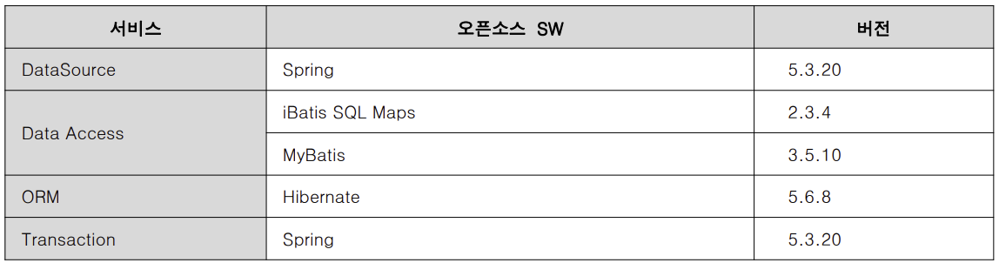

### 실행환경 - 데이터처리
실행환경의 데이터처리 레이어는 데이터베이스에 대한 연결 및 영속성 처리, 선언적인 트랜잭션 관리를 제공하는 layer

** 영속성 처리 : 프로그램이 실행되는 동안 생성된 데이터를 메모리에서 영구적으로 저장하고, 필요할 때 검색하고 수정할 수 있는 기능. 영속성이란 데이터를 생성한 프로그램이 종료되더라도 사라지지 않는 데이터의 특성을 의미함.

#### 1. 데이터처리 레이어
spring, iBatis, MyBatis, Hibernate 등 총 4종의 오픈소스 SW를 사용하고 있음

    데이터처리 레이어는 총 4종의 서비스를 제공
    
    1. DataSource 서비스 : 데이터베이스에 대한 연결을 제공하는 서비스
    <참고자료>
    - Commons DBCP: http://commons.apache.org/dbcp/
    - C3P0 : http://www.mchangecom/projects/c3p0/index.html

    2. Data Access : 다양한 데이터베이스 솔루션 및 데이터베이스 접근 기술에 일관된 방식으로 대응하기 위한 서비스
    -JDBC를 사용한 Data Access를 추상화하여 간편하고 쉽게 사용할 수 있는 Data Mapper framework인 iBATIS/Mybatis 를 Data Access 기능 기반의 오픈 소스로 채택
    - iBATIS/Mybatis를 사용하면 관계형 데이터베이스에 엑세스하기 위해 필요한 자바 코드 사용을 현저히 줄일 수 있으며 간단한 xml 기술을 사용하여 sql문을 JavaBeans(또는 Map)에 간편하게 매핑할 수 있음

    ** iBatis : 단순성이라는 사상을 강조한 퍼시스턴스 프레임워크로, SQL 맵을 이용하여 반복적이고 복잡한 DB 작업 코드를 최소화함
    -> 단순성이라는 사상을 강조하여, XML을 이용하여 Stored Procedure 혹은 SQL문과 자바 객체간의 매핑을 지원

    ** MyBatis 데이터 매퍼 서비스(iBatis를 개선 보완한 프레임워크)
    - 개발자가 작성한 sql문 혹은 저장프로시저 결과값을 자바 오브젝트에 자동 매핑하는 서비스
    - 수동적인 JDBC 방식의 데이터 처리 작업 코드와는 달리 쿼리결과와 오브젝트 간 자동 매핑을 지원
    - SQL문과 저장프로시저는 XML 혹은 어노테이션 방식으로 작성 가능

    <참고자료>
    - iBatis : http://ibatis.apache.org
    - Spring Framework - Reference Documentation : http://docs.spring.io/spring/docs/3.2.x/spring-framework-reference/htmlsingle/#orm-ibatis
    - MyBatis 개발자 가이드 : http://myBatis.github.io/mybatis-3/

    3. Transaction : 트랜잭션 서비스는 spring 트랜잭션 서비스를 채택

    <종류>
    ㆍ DataSource Transaction Service
        : DataSource를 사용하여 Local Transaction을 관리
    ㆍ JTA Transaction Service
        : JTA를 이용하여 Global Transation관리
    ㆍ JPA Transaction Service
        : JPA EntityManagerFactory를 이용하여 트랜잭션을 관리
        : EntityManagerFactory에 의존성을 가지고 있으므로 반드시 EntityManagerFactory 설정과 함께 정의되어야 한다

    <트랜잭션 활용 방법>
    ㆍ XML 설정 및 Annotation을 통해 활용할 수 있는 Declaration Transaction Management
        : 코드에서 직접적으로 Transaction 처리하지 않고 선언적으로 Transaction을 관리
    ㆍ 프로그램에서 직접 API를 호출하여 쓸 수 있도록 하는 Programmatic Transaction Management
        : 프로그램에서 직접 트랜잭션을 관리하고자 할 때 사용
    
    <참고자료-spring transaction management>
    - https://docs.spring.io/spring-framework/docs/5.3.x/reference/html/data-access.html#transaction